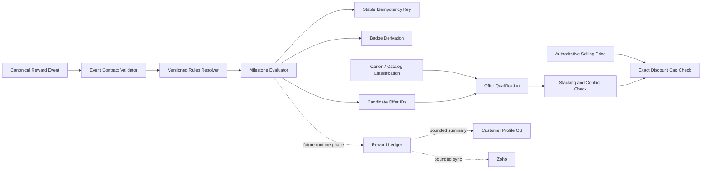

# MySnoozePod Rewards Phase 1A Foundation

## Status

Phase 1A defines isolated, non-production reward contracts. It does not issue
points, grant offers, alter prices, write reward records, call Zoho, or change
any customer-facing runtime.

The example rules file is deliberately marked `draft`. Its configured award and
discount values are zero until founder approval and a later activation phase.

## Boundaries

This phase adds:

- Versioned reward event and rules contracts.
- Deterministic milestone and badge evaluation.
- Stable idempotency-key derivation.
- Curated product classification and offer qualification.
- Conservative offer stacking and conflict checks.
- Exact integer discount-cap validation.
- Bounded Customer Profile and Zoho synchronization payloads.
- Safe, stable error contracts.

This phase does not add:

- Runtime route wiring.
- DynamoDB reward ledgers or balances.
- Reward writes from assessment, Rest Test, cart, checkout, HUD, or IoT.
- Shopify discounts, automatic discounts, price rules, or checkout changes.
- Zoho network calls.
- Customer-facing rewards UI.
- Post-purchase or referral rewards.

## Architecture

Only dotted edges are future runtime work.

## Source Files

| File | Responsibility |
| --- | --- |
| `services/rewardsDomain/constants.js` | Approved enums, authorities, badge ceiling, and schema versions. |
| `services/rewardsDomain/errors.js` | Stable diagnostic and shopper-safe error contracts. |
| `services/rewardsDomain/rules.js` | Rules validation, activation checks, and badge derivation. |
| `services/rewardsDomain/events.js` | Reward event validation and deterministic evaluation. |
| `services/rewardsDomain/idempotency.js` | Repeat-policy-aware idempotency keys. |
| `services/rewardsDomain/money.js` | Exact decimal-to-minor-unit parsing and discount caps. |
| `services/rewardsDomain/offers.js` | Curated product classification, qualification, and stacking. |
| `services/rewardsDomain/profileSummary.js` | Bounded Customer Profile reward summary patch. |
| `services/rewardsDomain/zohoSync.js` | Zoho payload, deduplication, staleness, and retry contracts. |
| `data/rewards-rules.phase1a.example.v1.json` | Draft, non-production example rules. |

## Authority Model

| Decision | Authority |
| --- | --- |
| Milestone points | Active versioned reward rules |
| Badge thresholds | Active versioned reward rules |
| Product reward categories | Canon, catalog, or showroom manifest classification |
| Selling price | Shopify/backend commerce truth |
| Discount eligibility | Reward rules plus curated product classification |
| Discount cap | Internal rules evaluated against authoritative selling price |
| Cart and checkout | Existing Shopify/backend commerce path |
| Profile summary | Reward ledger projection in a future phase |
| Zoho summary | Bounded projection, never the reward source of truth |

Product names and customer-entered text are never used to infer reward
classification.

## Event Contract

A reward event must contain:

- `schemaVersion`
- `eventId`
- `eventType`
- `occurredAt`
- `receivedAt`
- canonical `shopperId` or `profileId`
- `sessionId`
- `subjectType`
- `subjectId`
- approved `sourceSurface`
- approved `sourceSystem`
- `rulesVersion`
- event-specific `metadata`

Clients may report completion facts only. They may not provide points, badges,
discounts, offer eligibility, reward balances, or award decisions. Those fields
are rejected even when nested inside metadata.

Route visits, page views, cart opens, and checkout starts are not Phase 1A
reward events.

## Draft Milestones

The example file documents candidate milestones for:

- Assessment completion.
- Rest Test completion.
- Pod comparison.
- Learn completion.
- Customize completion.
- Pod rating.
- Full showroom journey completion.

Only assessment and Rest Test are marked as implemented candidates. They still
award zero points because the entire file remains draft. All other milestones
remain disabled future definitions.

## Repeat and Idempotency Rules

Idempotency keys use canonical identity, milestone, rules version, repeat
policy, and the stable repeat scope. They intentionally ignore transport
`eventId`, so retries cannot create duplicate awards.

| Repeat policy | Stable scope |
| --- | --- |
| `once_lifetime` | Canonical shopper/profile |
| `once_per_journey` | Journey ID |
| `once_per_appointment` | Appointment ID |
| `once_per_session` | Session ID |
| `once_per_pod` | Pod ID |
| `once_per_subject` | Subject type and subject ID |
| `once_per_interval` | Rule-defined interval bucket |
| `non_repeatable` | Canonical shopper/profile |

Missing evidence for a selected repeat policy fails closed.

## Badge Contract

The approved Phase 1A badge sequence is:

1. Explorer
2. Rest Tester
3. Sleep Scholar
4. Snooze Specialist

Snooze Specialist is the enforced ceiling. Badge thresholds in the example
rules are placeholders for founder approval, not live business policy.

### Existing Prototype Conflicts

The repository still contains prototype labels that this isolated foundation
does not modify:

- `omnia-journey/src/Layout.jsx` derives both `Sleep Specialist` and
  `Master of Rest`.
- `omnia-journey/src/lib/useRewards.js` contains the same two prototype badge
  labels.

Those labels conflict with the approved progression. `Sleep Specialist` should
eventually become `Snooze Specialist`, while `Master of Rest` must not be
available before purchase. Phase 1A leaves both files untouched to avoid
changing active UI behavior. The new validator rejects either label as a new
showroom badge.

## Offer Contract

The draft supports these offer shapes:

- Completion gift.
- Fixed-dollar mattress savings.
- Fixed-dollar base savings.
- Buy-one-get-one pillow offer.
- Percentage savings on a second pillow.
- Qualifying accessory gift.

Every offer declares:

- Eligible curated product categories.
- Required milestone IDs.
- Stacking mode.
- Exclusivity group.
- Compatible offer types and groups.
- Effectivity and status.

Unknown product classification, missing milestones, unsupported stacking, or
conflicting exclusivity groups fail closed.

## Discount Safety

Money is converted to integer minor units before comparison. Percentage caps use
integer basis points and floor division:

`capMinorUnits = sellingPriceMinorUnits * capBasisPoints / 10000`

This avoids binary floating-point drift. Unknown, negative, malformed, or
over-precision selling prices are rejected. The example internal cap is not
customer visible, and shopper-safe errors do not disclose it.

Shopify remains the source of truth for price, variants, availability,
inventory, media, cart, and checkout.

## Customer Profile Boundary

A future reward ledger may project only these summary fields into Customer
Profile OS:

- `pointsBalance`
- `lifetimePoints`
- `badgeId`
- `badgeLabel`
- `lastRewardEventAt`
- `rewardsRulesVersion`
- `updatedAt`

The profile summary is not the ledger and must not be used to reconstruct award
history.

## Zoho Boundary

Zoho receives bounded summaries or timeline facts only. It does not calculate
points, badges, eligibility, discounts, or balances.

The contract includes:

- Canonical profile identity.
- Deterministic sync deduplication keys.
- Stale-update protection using `updatedAt`.
- Retryable classification for network, throttling, and server errors.
- Terminal classification for invalid client payloads.

No secrets or unrelated profile PII belong in reward synchronization payloads.

## Error Contract

Every domain failure returns:

- stable `code`
- internal `diagnosticMessage`
- shopper-safe `publicMessage`
- `retryable`
- suggested `httpStatus`
- bounded `details`

Public messages do not disclose internal discount caps or implementation
details.

## Activation Requirements

Before any runtime integration:

1. Founder approves milestone point values and badge thresholds.
2. Founder approves each offer value, compatibility, and expiration policy.
3. Production rules receive a new immutable `rulesVersion`.
4. Production rules are marked `active` with explicit effectivity dates.
5. A reward ledger and conditional idempotency write are implemented.
6. Runtime integration is added one surface at a time behind explicit flags.
7. Shopify discount mechanics are validated without changing commerce truth.
8. Customer Profile and Zoho projections are tested as non-blocking consumers.
9. Rollback disables the active rules version without deleting ledger history.

## Future Persistence Plan

Phase 1B should introduce an append-only reward ledger, a conditionally written
idempotency claim, and a derived shopper summary in one authoritative
transaction. The ledger remains immutable except for explicit compensating
events such as reversals. Customer Profile OS and Zoho consume projections; they
do not replace the ledger.

## Future Frontend Plan

Frontend surfaces should report completion facts through narrow backend
commands. They must never submit point values, badge labels, offer eligibility,
or discount amounts. Read-only balances and unlock summaries should come from
the backend after ledger persistence. Existing prototype reward calls should be
retired surface by surface only after the authoritative engine is live.

## Future Checkout Redemption Plan

Redemption should validate an unlocked offer against the authoritative ledger,
curated product classification, current Shopify selling price, compatibility,
and the internal cap before creating a Shopify-compatible application request.
Shopify remains authoritative for the final discount application, cart,
checkout, and order. A failed reward service must not corrupt or block ordinary
checkout.

## Future Expansion

Reserved namespaces exist for post-purchase, referral, booking, and loyalty
events, but Phase 1A does not implement them. Future phases should add new
versioned event and rules contracts rather than changing historical versions.
